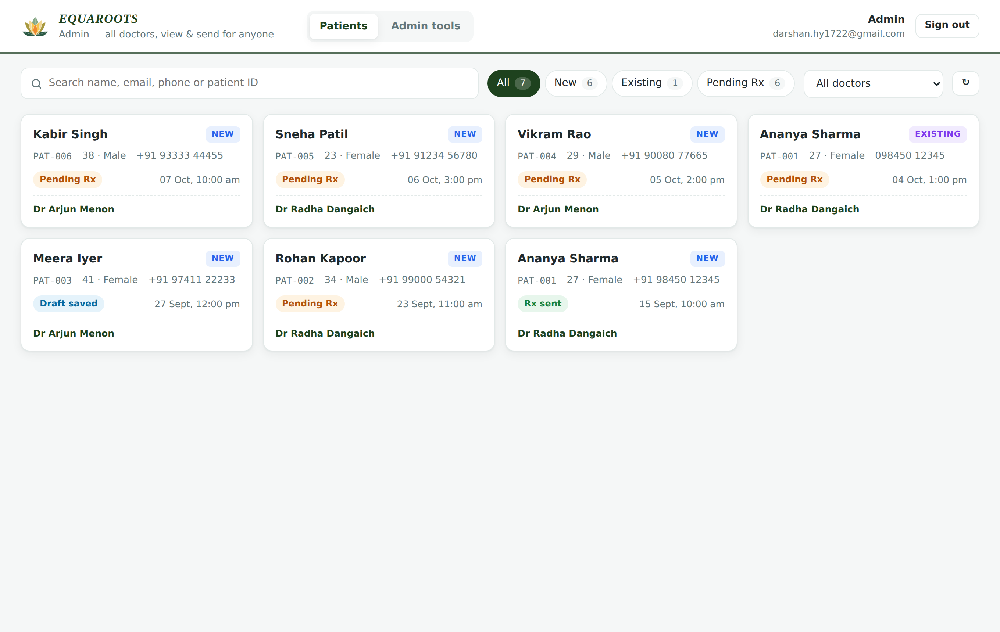
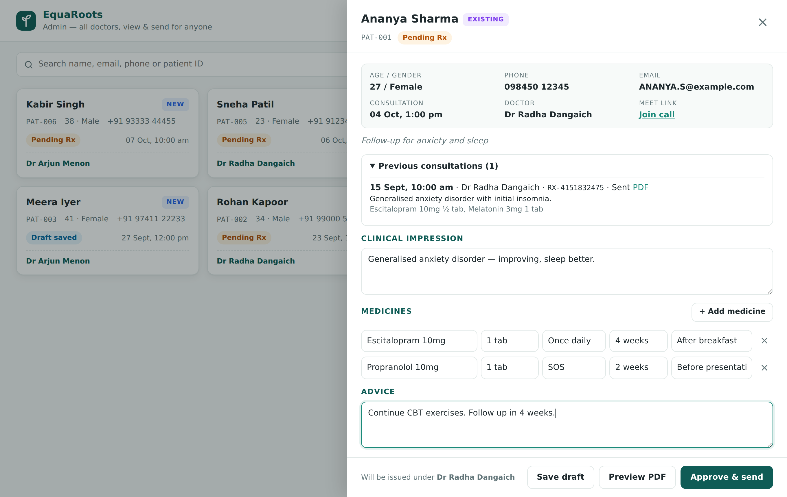
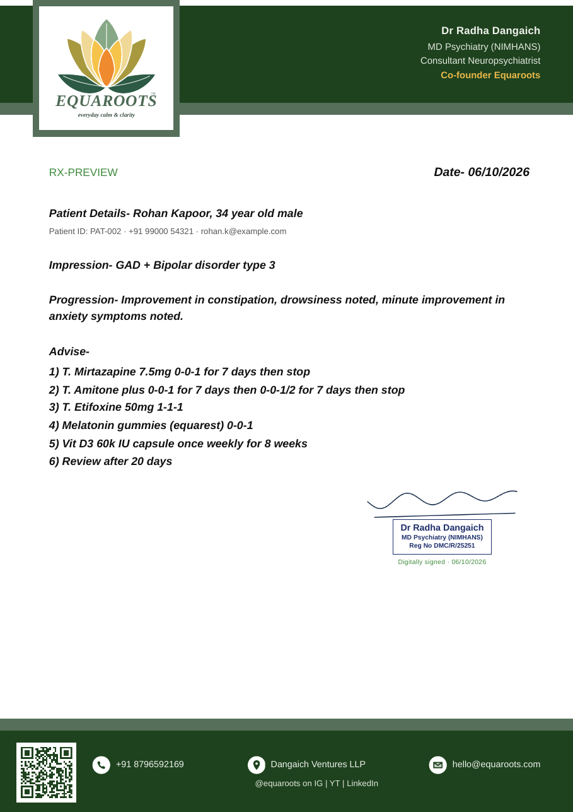
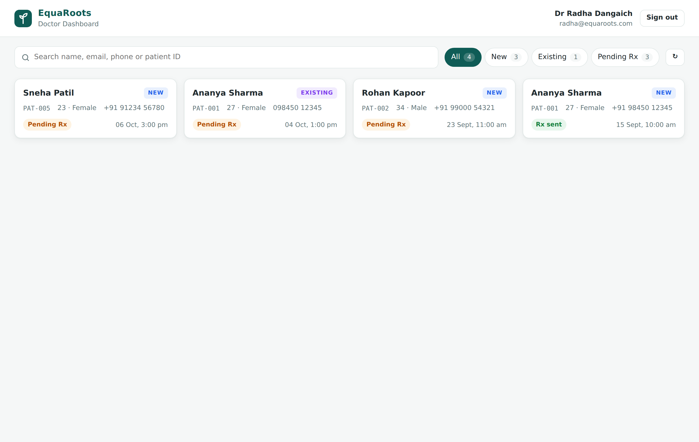
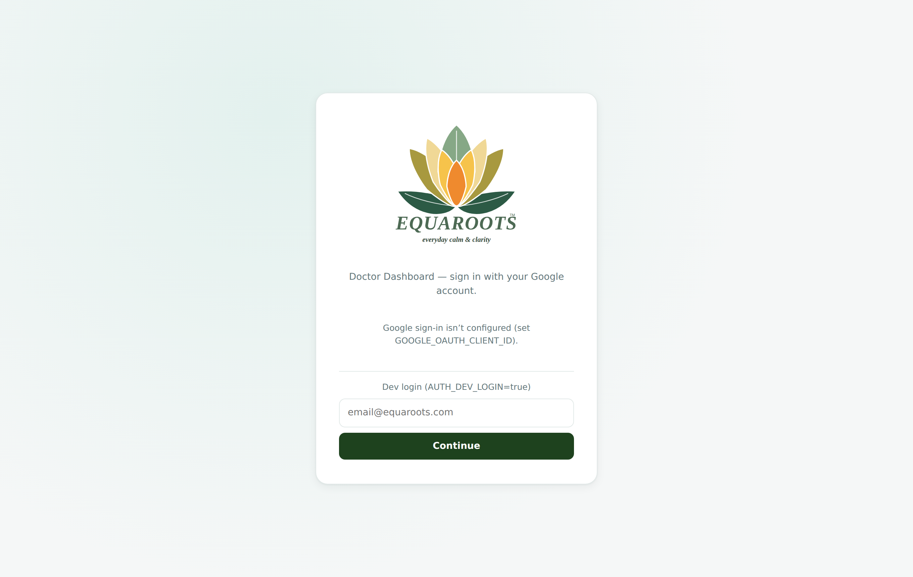
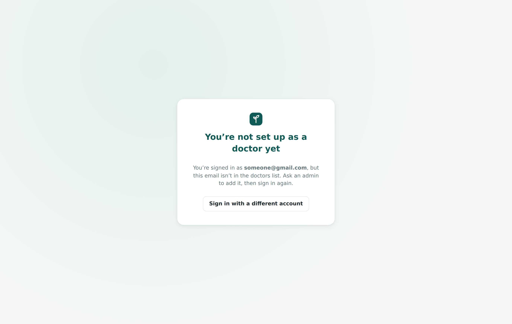
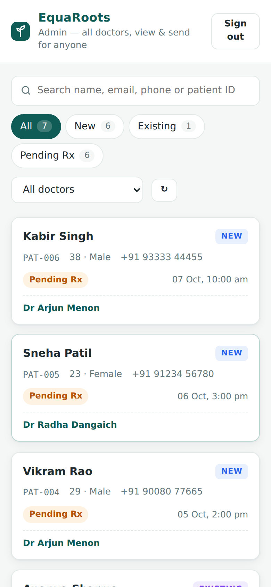

# EquaRoots Doctor Dashboard

The EquaRoots psychiatry telehealth dashboard, rebuilt as a regular web app with
its own API and a PostgreSQL database. It replaces the Google Apps Script +
Google Sheets version and keeps the same business rules.

- **Cal.id → `/api/webhooks/cal`**: Cal.id posts to this endpoint directly. It checks the HMAC (`X-Cal-Signature-256`), so no Pipedream relay is needed.
- **Patient IDs**: clinic IDs in the format **`ER/<yy>/<nn>`** (e.g. `ER/26/150`), matched on email or the phone's last 10 digits, with a **New/Existing** flag. Load the clinic's patient register once (**Admin tools → Import → Patient register**, `.xlsx` or `.csv`); new patients then continue the sequence (`ER/26/151`, …, restarting each year as `ER/27/01`).
- **Visibility**: doctors see only their own patients. Admins (`ADMIN_EMAILS`) see everyone and can filter by doctor.
- **Prescriptions**: you can save a draft, preview the PDF, or approve & send. Sending renders the PDF with Puppeteer, stores it privately, emails it to the patient and marks the booking `Prescription Sent`.
- **Admin impersonation boundary**: the PDF and email always use the **treating doctor's** name, qualification and registration number, never the admin's. This is enforced on the server.



| Prescription drawer | Generated PDF (EquaRoots letterhead) |
|---|---|
|  |  |

| Doctor view (own patients only) | Sign in | Unrecognised email | Mobile |
|---|---|---|---|
|  |  |  |  |

## Stack

| Concern | Choice |
|---|---|
| API | Node 22 + TypeScript + Express 5 (`server/`) |
| DB | PostgreSQL. SQL migrations in `server/migrations`, applied automatically on boot |
| Frontend | React + Vite (`web/`), served by the API in production (one deployable) |
| Auth | Google Identity Services ID token, verified on the server, then an httpOnly JWT session cookie |
| PDF | Puppeteer (`puppeteer-core` + system Chromium) |
| Email | SendGrid. Without a key, mail goes to `server/data/outbox` |
| Storage | Any S3-compatible private bucket (S3/R2/Supabase), served with 15-min presigned URLs. Without a bucket, PDFs go to local disk and are served with HMAC-signed expiring links |

## Run locally

```bash
# Postgres 16 running locally with a database "equaroots"
cp .env.example server/.env          # set AUTH_DEV_LOGIN=true for passwordless local login
npm install
npm run seed:demo                     # optional demo doctors / medicines / bookings
npm run build && npm start            # http://localhost:8080
# or for hot reload: npm run dev       (Vite on :5173, proxied to the API on :8080)
```

Tests run against a real Postgres database (`equaroots_test`) and render real PDFs:

```bash
npm test
```

## API

All endpoints require a session except the webhook.

| Method | Path | Notes |
|---|---|---|
| POST | `/api/webhooks/cal` | Raw body, HMAC verified. `BOOKING_CREATED`/`RESCHEDULED` upserts by `cal_uid` (a reschedule follows `rescheduleUid`) and runs patient ID assignment. `BOOKING_CANCELLED` sets the booking to `CANCELLED`. Any other event is only logged. Every request writes a `webhook_logs` row. |
| GET | `/api/bootstrap` | `{ authorized, isAdmin, email, doctor, doctors[], medicines[] }` |
| GET | `/api/patients[?doctor_id=]` | Doctor: own patients only. Admin: all patients, with an optional filter |
| GET | `/api/patients/:patientId/history?exclude_booking_id=` | Earlier consultations for the patient |
| GET | `/api/bookings/:bookingId/draft` | Latest draft or sent consultation, plus a signed PDF link |
| POST | `/api/prescriptions?action=draft\|send` | `{ bookingId, impression, advice, medicines[] }` |
| GET/POST | `/api/prescriptions/:bookingId/preview[?format=base64]` | Renders the PDF and writes nothing (POST previews unsaved form content) |
| POST | `/api/admin/import-patient-register` | `{ table }` (rows from the .xlsx) or `{ csv }`: loads the ER-ID register and re-keys bookings to it |
| POST | `/api/admin/import-csv` | `{ doctors, medicines, bookings, consultations }` as CSV strings |
| POST | `/api/admin/reassign-token` | Rotates the Cal HMAC secret and returns it once |
| GET | `/api/admin/webhook-logs` | Recent webhook log entries |
| POST | `/api/auth/google` · `/api/auth/logout` | Sign in / sign out |

## Migrating from the Google Sheet

Export the `Doctors`, `Medicines`, `Booking Data` and `Consultations` tabs as CSV
files into one folder, then run:

```bash
npm run migrate:sheet -- ./sheet-export
```

The script inserts doctors and medicines first, then bookings. It keeps
`patient_id`/`patient_type` exactly as the old system assigned them and does not
recompute them. Consultations are then linked by booking UID, falling back to
patient name + date. At the end it prints a summary of rows migrated and rows
skipped, with reasons. Header names are matched loosely, so small differences in
column titles are fine.

## Deploy (Render)

`render.yaml` sets up a Docker web service (Chromium included) and a managed
Postgres database. After the first deploy:

1. Set `APP_BASE_URL`, `GOOGLE_OAUTH_CLIENT_ID`, `SENDGRID_API_KEY`, `EMAIL_FROM` and the `STORAGE_*` variables.
2. In Google Cloud, create an OAuth Web client and add `APP_BASE_URL` as an authorised JavaScript origin.
3. In Cal.id → Settings → Developer → Webhooks:
   - Subscriber URL: `https://<host>/api/webhooks/cal`
   - Secret: the generated `CAL_WEBHOOK_SECRET` (or rotate one with `/api/admin/reassign-token`)
   - Events: created, rescheduled, cancelled
4. Run the sheet migration once against the production `DATABASE_URL`.

## Letterhead

Each treating doctor chooses the prescription layout used for their PDFs (**✍︎ My letterhead**, or **Admin tools → Doctors → Layout**), with a sample-PDF preview of each:

- **Modern** (default): white page, lotus logo + doctor header with a green→gold rule, patient card, medicines table with dose chips, advice bullets and a highlighted follow-up.
- **Sidebar**: green side panel with the logo, doctor details, contacts and QR; prescription on the right.
- **Classic**: the original green EquaRoots letterhead band.

All layouts keep the same lotus logo (`server/src/brand.ts`, `web/public/logo.svg`), the doctor's digital signature, and the clinic contact details (`CLINIC_*` env vars). The doctor shown is always the booking's treating doctor, never the admin who sends it.

## Security notes

- The webhook is rejected (401) and logged when the signature is missing or wrong. Signatures are compared in constant time.
- Server-side authorization check: `booking.doctor.email === you || you ∈ ADMIN_EMAILS`. The doctor identity printed on the PDF is always resolved from the booking (email first, then a normalised name, so "Dr. Radha" matches "Dr Radha").
- PDFs are never public. Links are signed and short-lived.
- `AUTH_DEV_LOGIN` must stay `false` in production.
